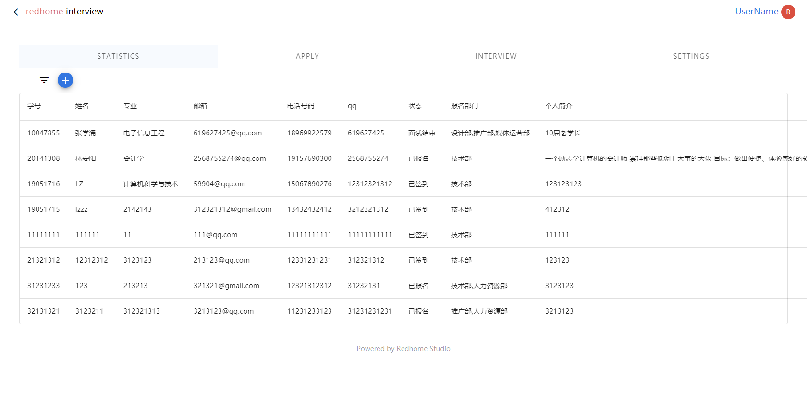
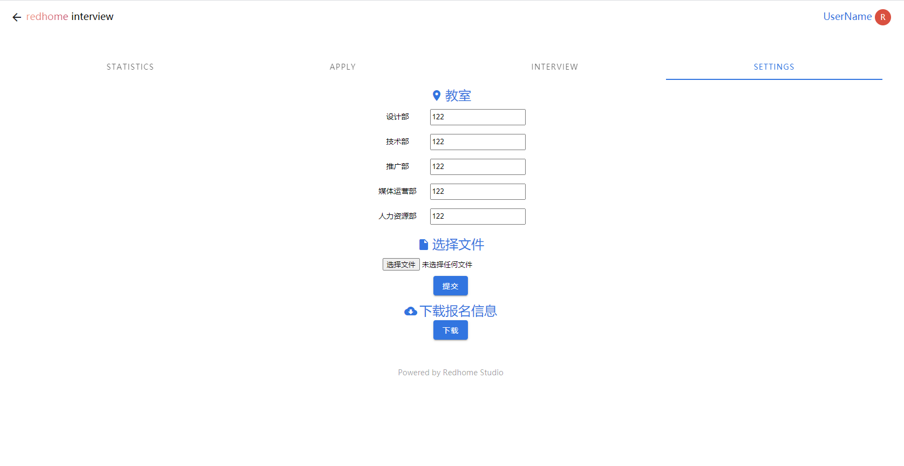
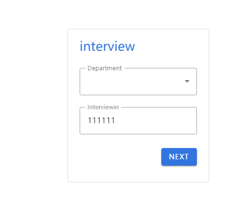
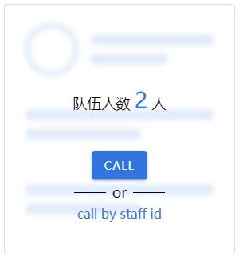
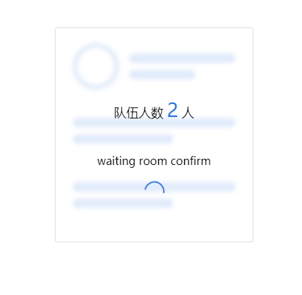
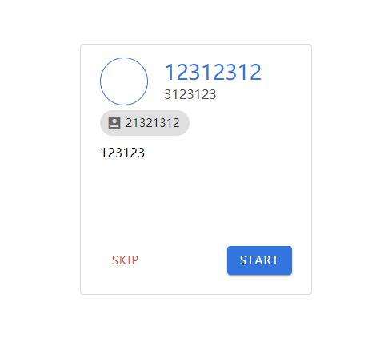
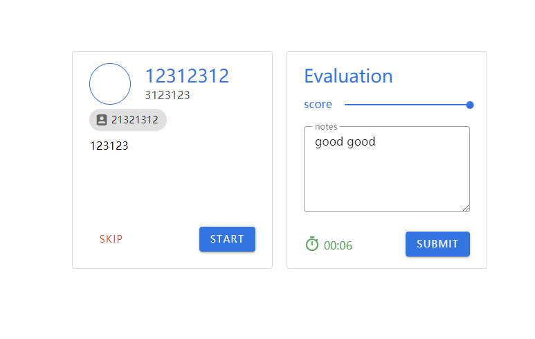
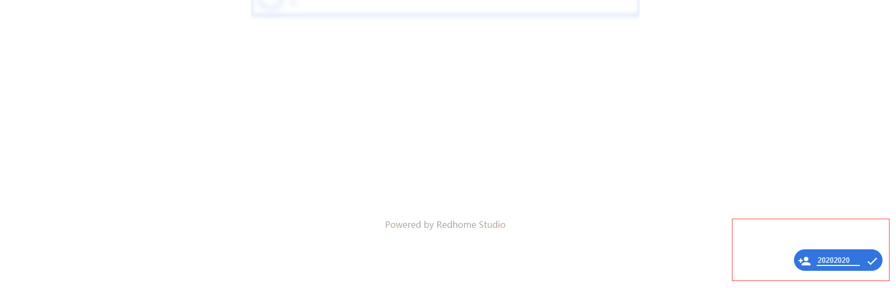
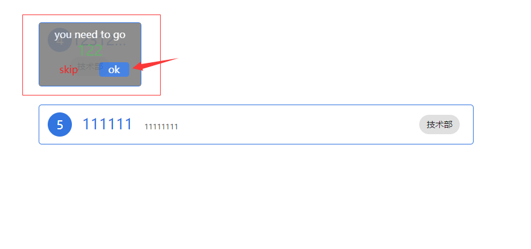

# 红家面试系统说明​ ​ ​ :smiley:

## 登录

[登陆界面](http://interview.redhome.cc/login.html)  （按住 Ctrl / Command 键点击打开网址）

## 面试总体流程

1. 面试者来到指定教室等候，由工作人员进行签到  （于room页面）
2. 面试官根据部门和学号进行叫号，点击NEXT按钮进入确认界面，点击CALL按钮确认面试  （于interview页面）
3. 等待大厅工作人员确认面试者准备完毕后，点击上方待确认区该面试者信息，选择ok，返回该面试者可以进行面试的信息 （于room页面）
4. 面试官点击START开始面试，进行打分和评价，面试完后点击提交  （于interview页面）
5. 开始新的一轮

## 各页面功能介绍

### manage页面

> 查询信息使用

#### 功能

+ 查看面试者基本信息
+ 查看面试者面试成绩
+ 更改各部门面试教室
+ 提交本地文件
+ 下载报名信息

### interview页面

> 面试官面试使用

#### 流程

1. 根据部门和学号，选择已于大厅签到的同学进行面试。点击NEXT进入确认界面，点击CALL确认面试
2. 点击CALL后，等待room大厅工作人员确认面试者准备完毕
3. 点击START开始面试
4. 面试官进行打分和评价，面试完毕点击提交
5. 选择新的面试者，开始新一轮

### room页面（大厅）

> 面试者签到使用、确认面试使用

#### 面试者签到

面试者来到等候大厅后，由工作人员点击右下角按钮，输入面试者学号，进行签到

#### 确认面试

面试者被面试官叫到后，其信息会移至上方待确认区。工作人员确认该面试者准备完毕，单击其信息，选择ok，返回该面试者可以进行面试的信息

